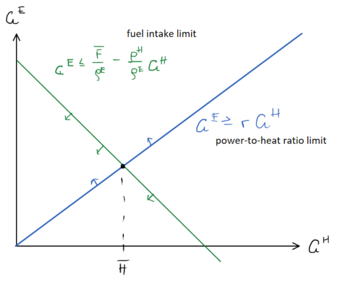
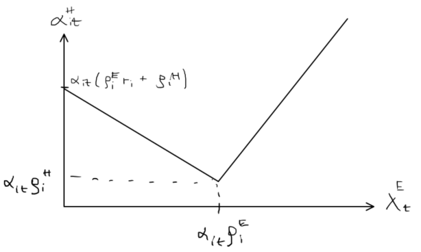

## Notes for CHP-implementation

We want to minimize the cost of heat such that heat demand equals heat supply:
```math
min \sum_{t}c_t^H \\
s.t. \sum_{i}G_{it}^H = L_{t}^H \forall t
```
$i$ and $t$ are indices for generators and time steps respectively.

### Variables

| Name   | Notation |     Description      |  Unit |
|----------|:--:|:-------------:|------:|
| `gen_heat` | $G_{it}^H$ | heat generation per plant (row) per hour (column), e.g. `gen_heat[1,:]` gives production for gen. 1 | MWh/h |
| `fuel_intake` | $F_{it}$ | fuel intake per plant per hour, e.g. `fuel_intake[1,:]` gives fuel intake for gen. 1 | *fuel/h* |

### Inputs

| Name   | Notation |     Description      |  Unit |
|----------|:--:|:-------------:|------:|
| `price_el` | $\lambda_{t}^E$ |  electricity price per hour | MWh/h|
| `load_heat` | $L_{t}^H$| total heat load for the area per hour | MWh/h |
| `price_fuel` | $\alpha_{it}$ | fuel price per plant (row) per hour (column), e.g. `price_fuel[1,:]` gives prices for gen. 1 | DKK/fuel |

### Parameters
| Name   | Notation |     Description      |  Unit |
|----------|:--:|:-------------:|------:|
| `phr` | $r_i$ | heat-to-power ratio, so that `phr[1]` is phr for gen. 1 | - |
| `eff_el`   | $ϱ_i^E$ | fuel efficiency for electricity so that `eff_el[1]` is the efficiency for gen. 1  | fuel/MWh el  |
| `eff_heat`   | $ϱ_i^H$ | fuel efficiency for heat so that `eff_heat[1]` is the efficiency for gen. 1  | fuel/MWh heat  |
| `max_fuel_intake` | $\bar{F_i}$ | maximum fuel intake per hour so that `max_fuel_intake[1]` is the max fuel intake for gen. 1 every hour | fuel/h |
| `max_heat_gen` | $\bar{G}_i^H$ | maximum heat generation per plant so that `max_heat_gen[1]` is the max heat generation for gen. 1 every hour | MWh/h |


#### Constraints
| Name | Constraint | Description |
|----------|:------------------:|-----|
| `con_fuel_phr`  | $F_{it} \geq G_{it}^H(ρ_i^E r_i + ρ_i^H) $ | Relation between fuel consumption and heat and production as well as the power-to-heat ratio (see calculations below)
| `balance` | $\sum\limits_i G_{it}^H = L_{t}^H \forall t$ | Defining that heat supply must equal demand at any given hour

### The optimization problem

The heat production cost $(c^H_{it})$ of CHP$_i$ at a given hour $t$ depends on the cost of fuel and the revenue from electricity sale:

$$c^H_{it} = F_{it} \alpha_{it} - \lambda^E_t G^E_{it} = \alpha_{it}(ϱ_i^E G_{it}^E + ϱ_i^H G_{it}^H) - \lambda^E_t G^E_{it}$$

The marginal heat production ($\alpha^H_{it}$) cost depends on the electricity price, $\lambda^E_t$, compared to the electricity production cost, $c^E_{it} = \alpha_{it}ϱ_i^E$. If the electricity price is low, the marginal heat production cost is the heat production cost at the minimum power-to-heat-ratio $r_i$. If the electricity price is high, the marginal heat production cost is the opportunity loss of producing an extra unit of heat at a ratio $\frac{ϱ^H_i}{ϱ^E_i}$: In this way we "pay" for the lost electricity revenue caused by producing more heat.

For this optimization problem, there are two case: Low electricity price $(λ_t^E \leq α_{it} ϱ_i^E)$ and high electricity price $(λ_t^E > α_{it} ϱ_i^E)$.

$\alpha_{it}^H = \alpha_{it}(ϱ_i^E r_i + ϱ_i^H) - λ_t^E r_i \; \mathrm{if} \; λ_t^E \leq α_{it} ϱ_i^E$
$\alpha_{it}^H = λ_t^E\frac{ϱ_i^H}{ϱ_i^E} \; \mathrm{if} \; λ_t^E > α_{it} ϱ_i^E$

For each plant there is an upper limit on the heat production (and a negative production is not possible), so we have the following constraint:

$0 \leq G_{it}^H \leq \bar{G}_i^H \qquad \forall i,t$

The fuel intake depends on the electricity and heat production as well as the production efficiencies, and has an upper limit:

$F_{it} = ϱ_i^E G_{it}^E + ϱ_i^H G_{it}^H \leq \bar{F}_i \qquad \forall i,t$

The electricity generation is not known, but depends on other parameters of this model. The connection between electricity and heat production depends on the power-to-heat ratio as such:

$G_{it}^E \geq r_i G_{it}^H \qquad \forall i,t$

Those two limits are shown in the figure below.



For low electricity prices, we want to produce as little electricity as possible, giving the following:

$G_{it}^E = r_i G_{it}^H \; \mathrm{if} \; λ_t^E \leq α_{it} ϱ_i^E$

$\bar{F}_i \geq ϱ_i^E r_i G_{it}^H + ϱ_i^H G_{it}^H = G_{it}^H(ρ_i^E r_i + ρ_i^H)$


For high electricity prices, we can't make that simplification. Looking at the figure, we know that the heat production must be lower than $\bar{H}$. Finding the crossing point between those two lines will therefore give us a new constraint that can be independant of the electricity production:

$$G^H_{it} = \frac{G_{it}^E}{r_i} = \frac{\bar{F}_i}{\rho_i^E r_i} - \frac{\rho_i G_{it}^H}{\rho_i^E r_i} ⇒ G_{it}^H \left (1+\frac{ρ_i^H}{ρ_i^E r_i} \right ) = \frac{\bar{F_i}}{ρ_i^E r_i} \Rightarrow G_{it}^H = \frac{\bar{F_i}}{ρ_i^E r_i} \frac{ρ_i^E r_i}{ρ_i^E r_i + ρ_i^H} = \frac{\bar{F}_i}{ρ_i^E r_i + ρ_i^H}$$

The above gives $\bar{H}$, the maximum value for $G^H$ given these two constraints. From this, we can get the exact same constraint as for low electricity prices:

$$G_{it}^H \leq \frac{\bar{F}_i}{ρ_i^E r_i + ρ_i^H} ⇒ \bar{F}_i \geq G_{it}^H(ρ_i^E r_i + ρ_i^H)$$


#### The objective function
Maximizing social welfare, in this case minimizing the heat production cost:

$$
\textrm{min} \; \sum\limits_{it} α_{it}^H G_{it}^H
$$

#### Observations
 - If electricity price is high ($λ^E_t \geq α_{it} ϱ_i^E$), heat price is high as well (probably a little higher than the electricity price)
 - If the electricity price is low ($λ^E_t \leq α_{it} ϱ_i^E$), the heat price will fall with rising electricity prices



### Future work
 - Implement it more

### Sources
Mitridati, L., Kazempour, J. & Pinson, P. _Heat and electricity market coordination: A scalable complementatity approach_. European Journal of Operational Research 283 (2020) 1107-1123
