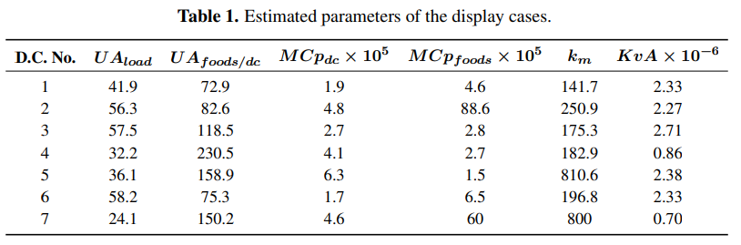

---
export_on_save:
    puppeteer: true # export PDF on save
    puppeteer: ["pdf", "png"] # export PDF and PNG files on save
    puppeteer: ["png"] # export PNG file on save
---

# Waste heat implementation
### Waste heat self-scheduling
**The "Stockholm"-model from [Open District Heating](https://www.oppenfjarrvarme.se/):**
The heat prices are calculated from the forecasted outdoor temperature, and each provider schedules their own sale of heat (Spot Prima or Mix).

This model will model a refrigerator display cabinet (RDC) and the connected heat pump (HP) to allow flexibility of electricity consuption of the heat pump.

The RDC will be controlled to maintain a temperature between 2 and 5 °C.

The COP will be dependant on the outdoor temperature (TODO).

### Modelling temperature dynamics in refrigerator display cabinets (RDCs)
The energy balance for the RDC:
$$m^R c_p^R \frac{\mathrm{d}T^{air}}{\mathrm{d}t} = \dot{Q}^{S} + \dot{Q}^{F} - \dot{Q}^C$$
Where $\dot{Q}^{S}$ is the heat load from the sorroundings, $\dot{Q}^{F}$ is the heat transfer from the foodstuffs and $\dot{Q}^C$ is the cooling capacity, or the heat removed from the RDC by the heat pump. I will assume that the heat transfer from the foodstuffs is negligible $(\dot{Q}^F = 0)$ since the temperature difference between the foodstuffs and the RDC is no more than a few degrees at any time.

The energy flows can be expressed as $\dot{Q}=UA(ΔT)$, giving:

$$m^{R} c_p^{R} \frac{\mathrm{d}T^{air}}{\mathrm{d}t} = U^{SR} A^{R} (T^S-T^R) - \dot{Q}^C$$

The superscript $R$ refers to the air in the RDC and $S$ to the sorroundings (the inside of the supermarket).
 - $m^{R}$ and $c_p^{R}$ are the mass and specific heat capacity (constant pressure) for the air in the RDC.
 - $U^{SR}$ is the heat transfer from the supermarket to the RDC.
 - $A^R$ is the surface area of the RDC (the area allowing for heat transfer).
 - $\dot{Q}^C$ is the rate of heat removal from the RDC.

We would like the model to be discrete, and so will make the following approximation for each time step $t$:

$$\frac{\mathrm{d}T^{air}}{\mathrm{d}t} = T_t^{R} - T^R_{t-1}$$

The shorter the time-step, the more precise the estimation is.

In this case, the temperature at a certain time $t$ represents the temperature at the **end** of that timestep. In order to find $T_t$, you will need the amount of heat extracted during timestep $t$. The temperatures will be assumed constant during the timestep. From the preceding equations we get:

$$T_t^{R} - T^R_{t-1} = \frac{Δt}{m^Rc_p^R} \left(U^{SR} A^R(T^S_{t-1}-T^R_{t-1}) - \dot{Q}^C_{t}\right)$$

The term in the lagte parentheses gives an energy change per time $(J/s)$. Multiplying by the length of the timestep $\Delta t$ will give the quantity of energy transfer, and dividing by the heat capacity will calculate the resulting temperature change in the RDC. $\dot{Q}^C$ will remain constant for the entire time-step.

Introducing $Q^C_t = \dot{Q}^C_t Δt$ (the amount of energy removed from the RDC during timestep $t$)
Introducing $H^{SR} = U^{SR} A^R Δt$ (heat transfer per temperature difference for each time step)
Introducing $C_p^{R} = m^R c_p^R$ (heat capacity of the RDC, extensive property).

$$T_t^{R} - T^R_{t-1} = \frac{1}{C_p^R} \left( H^{SR} (T^S_{t-1}-T^R_{t-1}) - Q^C_{t} \right)$$

Assuming Carnot efficiency, we can relate the heat removed to the heat exhausted, $Q^H$, which can be sold as waste heat, and the electricity load, $L^E$:

$$Q^C = Q^H - L^E$$

And relating this to the COP of the heat pump, which is a function of ambient temperature $(T^A)$:

$$Q^H = COP(T^A) L^E$$

Meaning that we can rewrite the equation as such:

$$
T_t^{R} - T^R_{t-1} = \frac{1}{C_p^R} \left( H^{SR} (T^S_{t-1}-T^R_{t-1}) - (Q^H_{t} - L^E_{t}) \right)
$$

To make sure that the food doesn't spoil, we will implement an upper and lower limit on the temperature, such that:

$$\underbar{\textit{T}}^R \leq T_t^R \leq \overline{T}^R \quad \forall t$$

### Variables

| Name   | Notation |     Description      |  Unit |
|----------|:--:|:-------------:|------:|
| `output_heat` | $Q_{it}^H$ | heat output from heat pump $i$ during time interval $t$ so that `output_heat[1,:]` gives output for HP 1 | MWh/h |
| `load_el` | $L_{it}^E$ | electricity load from heat pump $i$ during time interval $t$ so that `load_el[1,:]` gives load for HP 1 | MWh/h |
| `temp_RDC`   | $T^{R}_{it}$  | temperature of RDC $i$ at the end of time interval $t$ so that `temp_RDC[1,:]` gives temp. of RDC 1 | °C |

### Inputs

| Name   | Notation |     Description      |  Unit |
|----------|:--:|:-------------:|------:|
| `price_el` | $\lambda_{t}^E$ |  electricity price per hour so that `price_el[1]` gives electricity price for time interval 1 | DKK/MWh |
| `temp_ambient` | $T_{t}^A$ | ambient temperature so that `temp_ambient[1]` is ambient temperature for time interval 1 | °C |
| `temp_supermarket` | $T_t^S$ | temperature inside the supermarket so that `temp_supermarket[1]` is the temperature inside the supermarket that uses HP 1  | °C |
| `price_waste_heat` | $λ_{t}^{WH}$ | price for waste heat a function of $T_t^A$ so that `price_waste_heat[1]` gives waste heat price for time interval 1  | DKK/MWh |
| `COP ` | $COP_{it}^H$ | Coefficient of performance *(as a function of $T^A$)* so that `COP[1,:]` gives COP for HP 1 | W heat / W el |

Electricity prices are DK1-prices from NordPool on 16/4 2021.

The ambient temperature is from Stockholm Söder on 16/4 2021.

For now: $\lambda_t^{WH}(T_t^A) = 380*0.92^{T_t^A}$ and COP is constant.
The function for waste heat price is from regression on prices from Stockholm Söder on 16/4 2021.

### Parameters
| Name   | Notation |     Description      |  Unit |
|----------|:--:|:-------------:|------:|
| `temp_limit` | $[\underbar{\textit{T}}_{i}^R : \overline{T}_i^R]$ | Temperature limits for the RDC so that `temp_interval[1,1]` and `temp_interval[1,2]` gives min and max temperatures for RDC 1 | °C |
| `heat_transfer` | $H_i^{SR}$ | $H^{RS} = U^{SR} A^R Δt$ - heat transfer from sorroundings to RDC so that `heat_transfer[1]` is the heat transfer for each time step for RDC 1 | W/K |
| `heat_capacity`  | $C_{p,i}^{R}$ | $C_p^{R} = m^R c_p^R$ - heat capacity of the RDC, so that `heat_capacity[1]` is the heat capacity of RDC 1  | J/K |

Parameters are taken from [1], table 1, where $H^{SR}$ is equal to $UA_{load}$ ($\textrm{[W/K]}$ I think) and $C_p$ is equal to $MC_p$ $\mathrm{[J/K]}$.

The maximum consumption of the fridge is not mentioned in [1], but in the Mekanik-data we see a max district heating pump power output of approx 10 kW. I will assume that the heat pumps have outputs resembling that (5, 10, 15 kW).

### Constraints
| Name | Constraint | Description |
|----------|:------------------:|-----|
| `con_COP` | $Q_{it}^H = COP_{it}^H L_{it}^E$ | Relation between the heat output and electricity consumption is determined by the COP |
| `con_temp_limit` | $\underbar{\textit{T}}_{i}^R \leq T_{it}^R \leq \overline{T}_i^R$ | The max and min allowed temperature for each RDC |
| `con_heat_limit` | $Q_{it}^H \leq \overline{Q}_i^H$  | Restriction on maximum output for each heat pump |
| `con_temp` | $T_{it}^{R} - T^R_{i(t-1)} = \frac{H_i^{SR}}{C_{p,i}^R} (T^S_{i(t-1)}-T^R_{i(t-1)}) - \frac{Q^H_{it} - L^E_{it}}{C_{p,i}^R}$ | Relation between HP operation and RDC temperature |

### Objective function
The objective is to maximize the revenue/minimize the costs for waste heat producers:

$$
    \min_{Q_{it}^H, L_{it}^E} \quad \sum_{i \in G, t \in T} L_{it}^{E} λ_t^E - Q_{it}^H λ_t^{WH} \\
$$

Where $G$ and $T$ are integer-vectors representing heat pumps $(G)$ and time steps $(T)$.

### Future work
 - Model COP based on ambient temperature
 - Find data for ambient temperature in the Copenhagen area

### Sources
Parameters for RDCs are taken from:
[1] [Shafiei, Seyed Ehsan; Rasmussen, Henrik; Stoustrup, Jakob. (2013). *Modeling Supermarket Refrigeration Systems for Demand-Side Management.* Energies, 6(2).](https://vbn.aau.dk/ws/portalfiles/portal/73786177/energies_2013.pdf)

### Notes
The 2019-weather-data is from DMI's measuring station "Dmi" in Copenhagen. There is a lot of missing data in March (08/03 - 18/03), so these dates have been changed for 2020-data. Missing data (2019-03-01 00:00 and 2019-12-06 13:00) has been changed for the previous hour's value.
